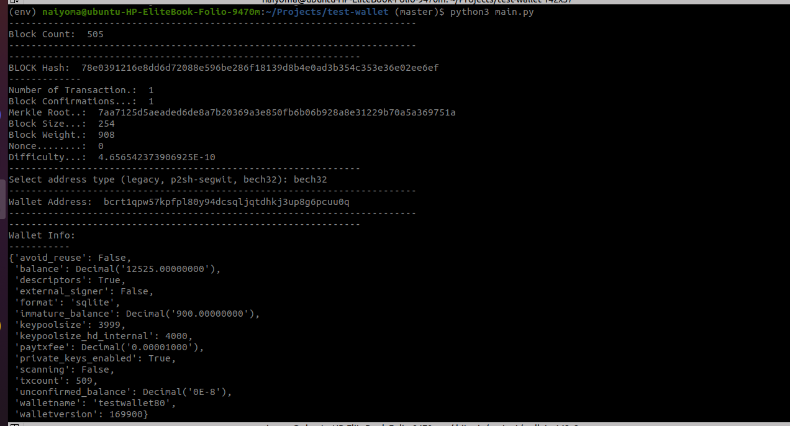
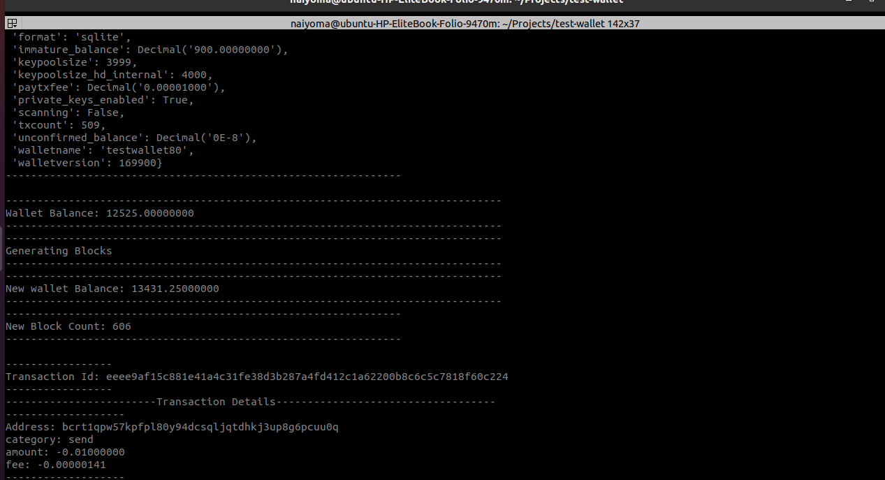

This Python script utilizes the `python-bitcoinrpc` library to interact with a running Bitcoin node (bitcoind). The script covers several  actions, such as:
- creating a wallet, 
- generating addresses, 
- retrieving block details,
- conducting transactions. 

## Prerequisites

1. **Python 3**: Ensure you have Python 3 installed on your system.

2. **Running bitcoind**: Make sure your Bitcoin node (bitcoind) is running.

3. **Virtual Environment (Optional but Recommended)**: Create a virtual environment to isolate the script's dependencies.

4. **Install python-bitcoinrpc**:

## Running the Script

2. **Follow Instructions**: The script will prompt you to choose an address type (legacy, p2sh-segwit, or bech32). Enter your choice accordingly.

3. **Script Output**: The script will display information about the block count, block details, wallet address, wallet info, balance, generated blocks, and transaction details.

## Important Notes

- **Fallback Fee Error**: If you encounter a "Fee estimation failed. Fallbackfee is disabled" error, the script sets a transaction fee (`settxfee`) to mitigate this issue.

- **Transaction Details**: The script performs a sample transaction, and you can find details such as the transaction ID, address, category, amount, and fee in the script output.

- **Bitcoin Node Configuration**: Ensure your `bitcoin.conf` file is properly configured with the necessary RPC settings.

- **Address Generation**: The script generates a new address based on the chosen type (legacy, p2sh-segwit, or bech32).

- **Wallet Creation**: A new wallet is created using the provided RPC credentials.

- **Block Generation**: The script generates 101 blocks to demonstrate block generation.

- **Transaction Execution**: A sample transaction is executed, and the script retrieves and displays transaction details.

### Sample Output

